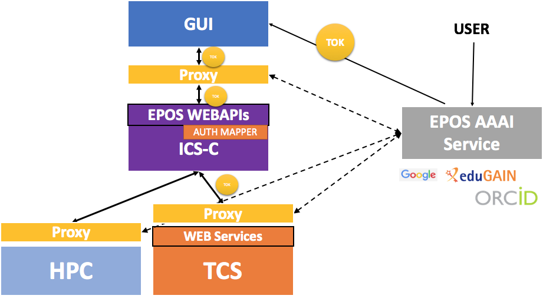

# AAAI  

## Introduction

EPOS AAAI is an integrated service for:

* Authentication, understood as central EPOS service for keeping user credentials and ensure a user is recognized in EPOS community
* Authorization, understood as a secure access to authentication attributes agreed in the EPOS community, that would be useful in the specific component to enable access to specific resources and functions (details are not yet defined)
* Accounting, understood as a collector of usage data (details are not yet defined) 

In the framework of EPOS, a general agreement was reached about the fact that management of AAAI should be handled by specialised institutions both for technical and governance reasons. For technical reasons, because in EPOS one of the main requirements is to be able to support and integrate several Authentication Systems, for governance reasons because AAAI management also requires to cope with administrative matters (i.e. identifying users and dealing with authorisations) which specialised institutions are already prepared to face.

The AAAI hosting institution should be indeed able to provide: 

1. IT authentication: the authentication that the user is the person (in role user) that they say they are; this can be done whether integrating existing AAAI Identity Providers or by providing registration features.
1. EPOS stakeholder authorisation management: it prescribes that EPOS organisation managers should be able to apply specific authorisation schemes to existing users in point (1), so that EPOS “knows” what users are entitled to use what resources.

## AAAI technical architecture 

AAAI is managed by an external EPOS component. This component has the following features:

* It can register new users
* It can integrate existing users from other Identity Providers (e.g. Edugain)
* It enables EPOS managers to assign specific authorisation to specific users
* When users are redirected from the GUI to the AAAI component, the AAAI component issues a token so that the GUI can act on behalf of the user
* It accepts connection by proxies at ICS and TCS level, that will check that the token is still valid, that the user has appropriate authorisation, session has not expired etc.



In figure above the architecture of components in EPOS system are presented. The architecture is kind of micro service approach where the system integrated many existing services. Many of them are developed specially to build EPOS system but others are the legacy services that need to be integrated (TCS services and e-infrastructure/HPC services). Therefore, mine challenge in implementing authentication and authorisation into the EPOS system that provides solution for a chains of API/web services calls. 

The relevant standard for this OAuth2 Token Exchange (in mature draft [OAuth2 Token Exchange](https://tools.ietf.org/html/draft-ietf-oauth-token-exchange-15)). This standard structure the tokens and mechanism to obtain and to validate them in Authentication Service. EPOS was validating this solution. It appeared that for legacy services and for wider adoption of solution creating an authentication proxy, this is a LUA module in web server, would be helpful solution. 

The general assumption is that context of authenticated user is transferred to the underlying web services using tokens. Important feature is that tokens can be added to HTTP call without interfering with semantics of the services itself. They are added as authentication mechanism as addition field in the header. Like here:

```
Authorization: Bearer TOKEN
```

EPOS AAAI is based on UNITY-IDM, which has implementation of OAuth2 Token Exchange mechanism and other functionalities documented at:
[Unity-2.8.0 documentation](http://www.unity-idm.eu/documentation/unity-2.8.0/). The software provides wide
configuration options and supports a wide range of Authentication and Authorization standards. The EPOS AAAI service is deployed to support delegation scenario.


### Features

EPOS AAAI provides the following features:

* Registration for local accounts
* Registration/login through external Authentication Providers: Google Account
* Required profile information and complementary registration for external providers
* Registration for OAuth2 Service Providers (valid for Portal)
* Authentication based on OAuth2 tokens
* Federated authentication based on OpenID Connect scheme

### Options for login/register

EPOS would like to take advantage of value gained by existing authentication infrastructures and services. Therefore, the planned options to register/login includes:

* EGI CheckIn -- collects various accounts (including EduGAIN accounts) and provide growing set of trusted attributes (like important institution affiliation or country), 
* TCS existing login (Identity Providers, LDAP if supported) -- to keep possibility of existing TCS users to use EPOS services,
* onsite registration -- for user that does not have any organisational account integrated, this require additional procedures to confirm email and required attributes, for users that want to register with social accounts email confirmation is not necessary.

Every method of registering will require completing a user profile with the required attributes. In case a method of authentication supports some of the user profile elements, the require attributes must be collected from user at the registration stage. 

### User profile

* first name
* last name(s) 
* email (confirmation)
* affiliation (can be confirmed by EduGAIN)
* researcher status (YES/NO default no)
* EPOS member (manually managed with some EPOS authority)
* special EPOS member groups membership

Level       | Required attributes | Requirements for user
----------- | ------------------- | ---------------------
untrusted   | (none)              | no email confirmation
normal user | user                | email confirmation (not confirmed name)
data access | user & access       | trusted affiliation
processing  | user & processing   | 
admin       | admin               | manually added to admin group

### Authentication for Web Services (WS) 

All EPOS services will work according to a delegation scheme based on OAuth2. The token will be added to each request from the GUI to any EPOS service including ICS-C components and TCS WSs.

TCS WS Authentication:

* Providers may implement authentication and authorization based on OAuth2 token and EPOS AAAI services. 
* For legacy systems the provider may user NGINX “proxy” which executes validity of token and selected attributes.

### GDPR

AAAI service will be main point of accepting data usage policies informed by the metadata catalogue. AAAI provider and ICS provider will guaranty compliance with GDPR. 

## Ingesting personal data into EPOS catalogue

In order to enable the ICS system to manage user authorisation, the authorisation information can be passed from the AAAI node to the EPOS CERIF catalogue through the token, which should include authorisation metadata.

Authorisation metadata can be of different kinds according to the Identity Provider that was used to authenticate the user, so at some point in the communication between AAAI node and EPOS catalogue, an authorisation metadata mapping procedure is envisaged.

For instance, this mapping procedure might establish that all users from “social accounts” have no rights of downloading datasets but only access to metadata, and that all users from official Identity Providers (like Edugain) are entitled at least to download both metadata and datasets.

## Integration at Service Providers

Detailed information for integration at Service Providers available here: [Guide to EPOS AAAI for service providers]()


> [Summary](../README.md)
