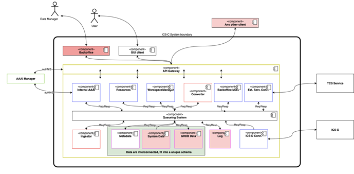

The following diagram describes the conceptual services of the architecture.

 

The driving concepts can be summarized by the following statements:

* Each of the Services is supposed to capture a well-defined functionality

* Services interaction is guaranteed by one main service, namely the queueing system

* Services interact through message exchanges

* A main "EPOS API Gateway" service ensures interaction between the system and external users (humans or machines)

* Services outside the ICS-C system boundary are external systems with which the ICS-C system is supposed to communicate and interoperate (AAI manager, ICS-D, TCS service)

* Services in the blue squares are implement functionalities required by the user and actionable by means of a RESTful APIs (proxied by the EPOS API Gateway).

* Currently, the following main functionalities emerged from the user requirements, here represented as RESTful APIs endpoints:

| Service Name | Endpoint | Description |
|--|--|--
| Resources Service | /api/resources-service/v1/ | Service for accessing assets stored in the ICS-C catalogue |
| External Access Service | /api/external-access-service/v1/ | Service for executing external services (from TCS) |
| Backoffice Service | /api/backoffice-service/v1/ | Service for managing metadata from the backoffice application |
| Processing Access Service | /api/processing-access-service/v1/ | Service or interacting with potential processing services |

*  Services in the red squares implement "support" functionalities, that is to say functionalities needed by the system, internally. Although the c converter is supposed to be an internal "support" service, this may implement Web-APIs to provide an additional service to end users.

* Data elements were differentiated in three different kinds:

  *  "Metadata", representing the "scientific metadata" that enable the system to manage the interaction with the TCS, and is mostly provided by the communities.

  * "System data", representing data needed by the users of the ICS-C system that should persist after the end of the session. It includes for instance information about workspaces, and may include workflow information.

  * "GRDB data", this represents the metadata currently stored in the Granularity Database, and partially overlapping with the "metadata" service
  
* The three data element above represent the data that the ICS-C system is required to manage. Such data that is intrinsically related, and requires referential integrity. For instance, a workspace (system data) is related to a user and to services (metadata) selected by users, and each update to the services needs to be reflected into the workspace for integrity reasons.

> [Summary](../README.md)
