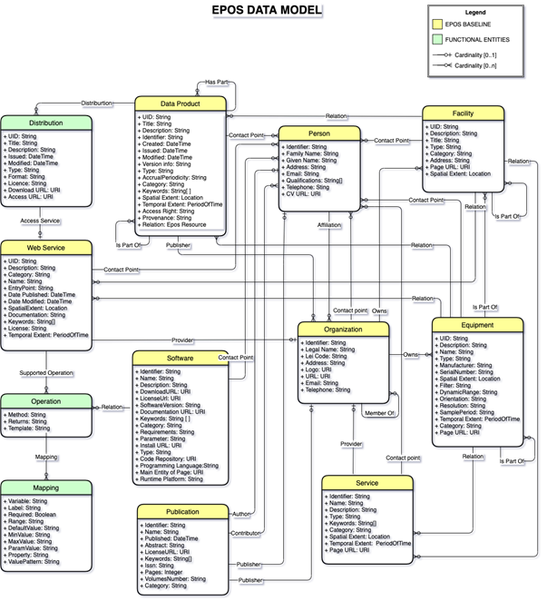

## **EPOS Data Model**

In order to guarantee that the concepts of interest in EPOS are well dealt with within the architecture, and in order to ensure that appropriate communication occurs among different modules, it was necessary to define an EPOS data model.

Such model is mostly conceptual, and serves for different purposes:

1. To define the structure of the information that the system provides to the end users by means of appropriate interfaces (e.g. web APIs)
2. To define the components of the system, that have the role of implementing specific functionalities
3. As a guideline to define inputs and outputs of the different system components

 The EPOS data model was discussed and defined in EPOS-IP as of 2018 in the document “Second (Final) Report on EPOS-ICS Architecture” and is here reported for reader’s convenience in the following class diagram.

The EPOS Data model includes the following concepts:

Person, Equipment, Facility, Service, Web service, Organization, Data, Software and mode code, Publication

 The data model defines the objects that the user will have to deal with in the EPOS ecosystem. This has consequences, for instance, in the definition of the User experience and associated functionalities implemented by the System modules.

> [EPOS Data Model PDF Description](EPOS_DATA_MODEL.pdf)